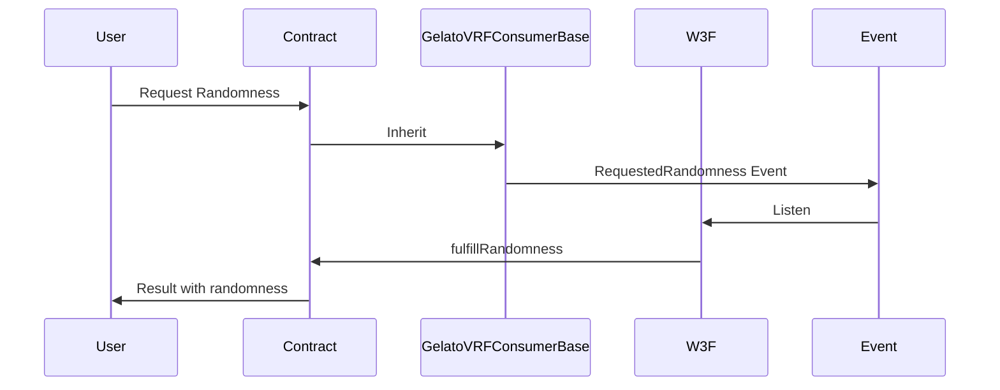
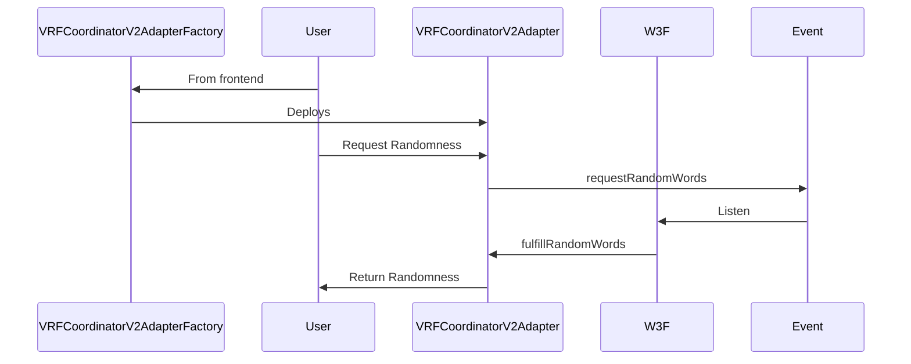

# Gelato VRF

Gelato VRF is a project that combines [Drand](drand.love) with Gelato Web3 Functions to obtain a randomness providing oracle for EVM-compatible blockchains. 

## Implementation Overview
In this repository you can find a Gelato Web3 Function that acts as the oracle for the smart contracts requesting randomness on-chain. The W3F is designed to listen for the `RequestedRandomness` event and fulfill it accordingly.


### Contracts
In the repositories the smart contracts are designed to cover two main use-cases:

1. "Vanilla" Gelato VRF should be in most cases the default option and allows to query and receive random numbers by implementing the `GelatoVRFConsumerBase.sol` contract

2. Handle Chainlink VRF compliant requests through the `VRFCoordinatorV2Adapter.sol` contract.


Both the aforementioned contracts implement the `IGelatoVRFConsumer.sol` interface, which is what the Web3 Function is able to operate with.

Some small difference lie in the setup required to make the W3F work depending on which use-case is being targeted.

1. For the Gelato VRF to work, the `GelatoVRFConsumerBase.sol` contract has to be inherited in the contract that should request and use the random number.

2. For the Chainlink Compatible VRF the `VRFCoordinatorV2Adapter.sol` contract has to be deployed. Each user has to deploy its own instance of the adapter. This can be easily achieved through the `VRFCoordinatorV2AdapterFactory.sol` factory contract, which also needs to be deployed on every supported chain.

It is important to note that unlike approaches that would look similar at first glance (like flashloans, that have a function to request and one to receive them) the request is not satisfied in the same block since Web3 Functions are used under the hood.

### Arbitrary user data

To enable further composability the `requestedRandomness` method supports passing arbitrary data that the W3F will forward in the callback.

To encode arbitrary data correctly `abi.encode` can be used like that:

```solidity
// Given some arbitrary values to pass to the callback
address arbitraryAddress = 0x...
uint256 arbitraryUint256 = ...
SomeContract arbitraryContract = ...

// Encode into an array of bytes
bytes arbitraryData = abi.encode(arbitraryAddress, arbitraryUint256, arbitraryContract);

// Request randomness for the randomnessConsumer
_requestRandomness(arbitraryData)
```

The randomness consumer is then able to decode the data using `abi.decode` in the `_fulfillRandomness` method:

```solidity
function _fulfillRandomness(
    uint256 randomness,
    uint256 requestId,
    bytes memory extraData
) external {
    // Decode the variables specifying their types
    (address arbitraryAddress, uint256 arbitraryUint256, SomeContract arbitraryContract) =
    abi.decode(extraData, (address, uint256, SomeContract));

    // Do something with the decode variables
    // ...
}
```

### User implementation details.

When implementing a Gelato VRF into their contracts there are two possibilities available:
1. Inherit `GelatoVRFConsumberBase.sol` is definitely the go-to option for most implementations since it already provides a request id, handles multiple requests correctly and offers replay attack protection.
2. Implementing `IGelatoVRFConsumer.sol` is a possibility if ever you feel like you need a different implementation of the VRF. However, it is not recommended.

## Web3 Function Details

### User arguments
- `consumerAddress: string` is the address that requests randomness and receives the callback from the W3F.

### Storage

Since event-driven W3Fs are not available at the time of development, each VRF tracks events independently as shown in [this example](https://github.com/gelatodigital/web3-functions-template/tree/3c1e859c8fe2e3dd4ba79525138adc667a23482f/web3-functions/event-listener) by keeping the latest checked block in the storage. This behavior will most likely change for a leaner approach once the events can be used as a trigger for automation. 

## Development Setup

1. Install project dependencies

```bash
yarn install
```

2. Configure your local environment:

- Copy `.env.example` to init your own `.env` file

```bash
cp .env.example .env
```

3. Complete your `.env` file with your private settings

## Deterministic deployment

Singleton contracts can be deployed using `npx hardhat deploy`.
